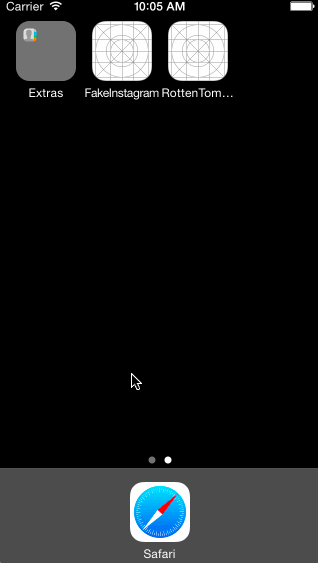

## Rotten Tomatoes

This is a movies app displaying box office and top rental DVDs using the [Rotten Tomatoes API](http://developer.rottentomatoes.com/docs/read/JSON).

Time spent: ~9 hrs

### Features

#### Required

- [x] User can view a list of movies. Poster images load asynchronously.
- [x] User can view movie details by tapping on a cell.
- [x] User sees loading state while waiting for the API.
- [x] User sees error message when there is a network error.
- [x] User can pull to refresh the movie list.
- [x] Must use Cocoapods.
- [x] Asynchronous image downloading must be implemented using the UIImageView category in the AFNetworking library.

#### Optional

- [x] Add a tab bar for Box Office and DVD.
- [ ] Implement segmented control to switch between list view and grid view.
- [x] Add a search bar
  - Uses the RT search API with live updating when the user stops typing for 0.5 second.
- [x] All images fade in.
- [x] For the larger poster, load the low-res first and switch to high-res when complete.
- [x] Customize the highlight and selection effect of the cell.
- [x] Customize the navigation bar.

#### Extra
- [x] Tapping the detail view fades in/out the movie information.
- [x] Use a category for runtime SVG asset rendering.
- [x] Display icon for critic score.

### Walkthrough

Credits
---------
* [Rotten Tomatoes API](http://developer.rottentomatoes.com/docs/read/JSON)
* [AFNetworking](https://github.com/AFNetworking/AFNetworking)
* [UIImage-SVG](https://github.com/Label305/UIImage-SVG)
* [http://stackoverflow.com/questions/17730138/uiimageviewafnetworking-setimagewithurl-with-animation]
* [The Noun Project](http://thenounproject.com)
